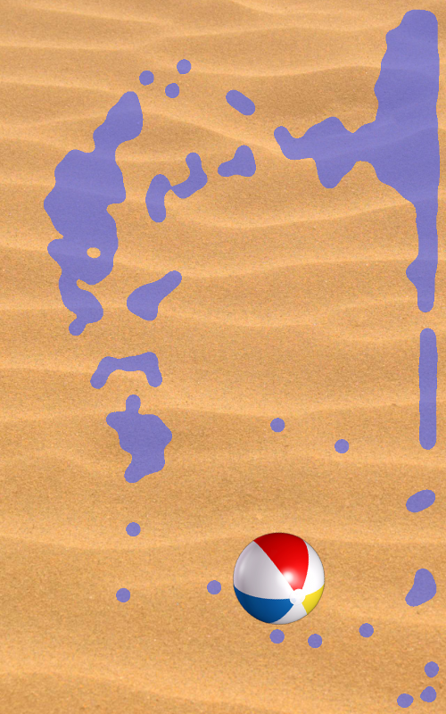

OGLESPhysicsDemo
================

OpenGL ES 2.0 2D Physics Demo

This is an Android demo I wrote using <a href="http://google.github.io/liquidfun/">LiquidFun</a> via SWIG bindings. 
LiquidFun is a 2D rigid-body and fluid simulation C++ library for games based upon Box2D. I wrote
the demo in <b>Java</b> using Android Studio 2.2.3 and tested it on Android 2.3.3 and 5.1.1 devices. 

It uses OpenGL ES 2.0 to render all graphics and this <a href="http://nullcandy.com/2d-metaballs-in-xna/">metaballs technique</a>
to render water. On older platforms (below Android 4.1) it renders bubbles instead of water.

The demo uses libliquidfun.so and libliquidfun_jni.so libraries built for arm processors. 
See <a href="http://google.github.io/liquidfun/SWIG/html/index.html">Java and SWIG</a> for building libs for other hardware.

    

Tilt the device in any direction to move the water and beachball around.
